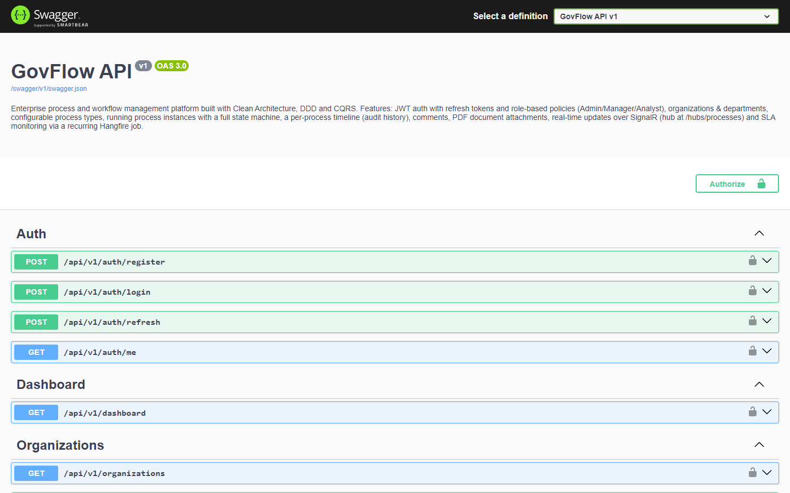
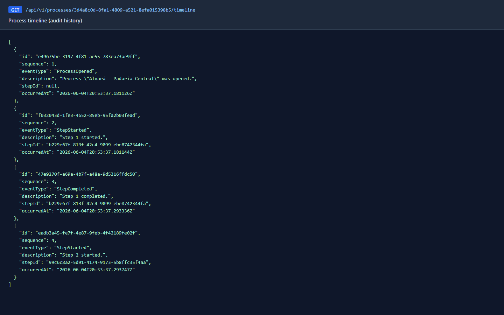
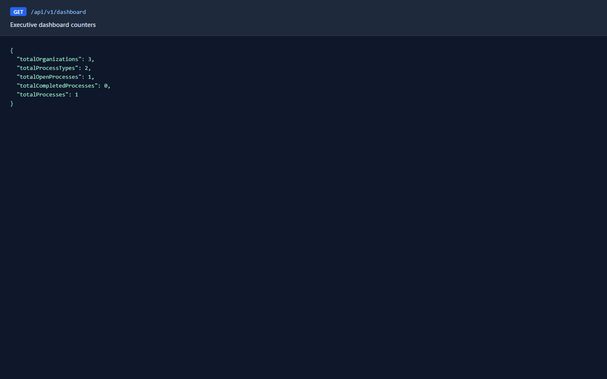
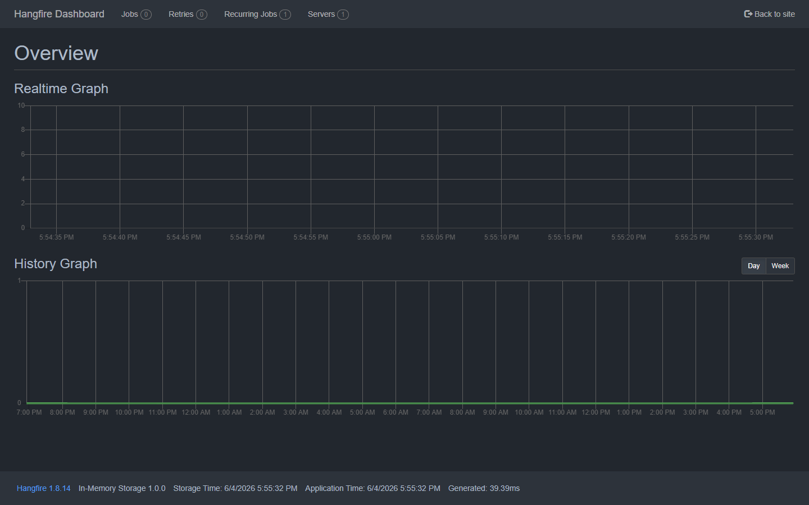

# GovFlow

Workflow and process management platform for organizations that need to route administrative
processes through configurable, multi-step workflows — with role-based access, a full audit trail,
SLA monitoring and real-time updates.

[](https://dotnet.microsoft.com/)
[](https://learn.microsoft.com/dotnet/csharp/)
[](https://www.postgresql.org/)
[](https://learn.microsoft.com/ef/core/)
[](#tests)
[]()

**Stack:** ASP.NET Core 8 · Entity Framework Core · PostgreSQL · MediatR · FluentValidation ·
SignalR · Hangfire · JWT · xUnit

---

## Overview

Organizations run on processes: a request is opened, moves through a sequence of steps handled by
different departments and people, and is eventually resolved. Doing this over email and
spreadsheets loses history, accountability and visibility.

GovFlow turns that into a configurable engine. Each organization defines its own **process types**
and the **workflow steps** for each one; users then open **process instances** that advance through
the workflow under a strict state machine. The platform covers the full lifecycle:

- **Process routing** through ordered workflow steps until resolution
- **Organizational workflows** scoped per organization (tenant) and department
- **Step control** with an explicit state machine (`Open → InProgress → Resolved / Cancelled`, with hold/return)
- **SLA monitoring** that flags processes left without activity
- **Audit trail** — every transition is recorded on an immutable timeline
- **Comments** authored by users on a process
- **Document management** with PDF uploads and pluggable storage

---

## Architecture

GovFlow follows **Clean Architecture** with dependencies pointing inward only — the domain has no
dependency on frameworks, the database or the web layer. Business behavior is modeled with **DDD**
(rich aggregates that own their invariants), and every operation is expressed as a command or query
through **CQRS / MediatR**.

```
src/
├── GovFlow.API             ASP.NET Core host: controllers, SignalR hub, middleware,
│                           authentication, background jobs, OpenAPI
├── GovFlow.Application      Use cases: commands, queries and handlers (MediatR),
│                           DTOs, validation, application-level interfaces
├── GovFlow.Domain          Aggregates, entities, enums, domain events and
│                           repository contracts — no external dependencies
└── GovFlow.Infrastructure  EF Core (PostgreSQL), repositories, read models,
                            identity (JWT/BCrypt), file storage
```

**Layer responsibilities**

| Layer | Responsibility |
|---|---|
| **Domain** | The core model. `ProcessInstance` is an aggregate root that owns its steps and timeline and enforces the workflow rules. Defines repository interfaces; references nothing external. |
| **Application** | Orchestrates use cases. Each command/query has its own handler; a FluentValidation pipeline behavior validates every request. Declares ports (`IFileStorageService`, `IProcessRealtimeNotifier`, `ICurrentUserService`). |
| **Infrastructure** | Implements the Domain and Application contracts: EF Core persistence and migrations, read repositories that project straight to DTOs, JWT issuance, BCrypt hashing and local file storage. |
| **API** | Thin HTTP layer: controllers delegate to MediatR, exceptions map to RFC 7807 Problem Details, JWT auth and role policies, the SignalR hub and the Hangfire scheduler. |

Read and write paths are separated (CQRS): writes load aggregates through repositories, while reads
project directly to DTOs and never return domain entities.

---

## Features

| Feature | Description |
|---|---|
| **Organizations** | Tenants that own their own processes and configuration |
| **Departments** | Organizational units scoped to an organization |
| **Process types** | Reusable templates with an ordered set of workflow steps |
| **Process instances** | Running processes with a full state machine and priority |
| **Workflow steps** | Materialized per instance from the template; advanced one at a time |
| **Timeline** | Immutable, chronological history of every transition (audit trail) |
| **Comments** | Notes authored by the authenticated user on a process |
| **Document upload** | PDF attachments with validation; storage abstracted for future cloud backends |
| **JWT authentication** | Access and refresh tokens; passwords hashed with BCrypt |
| **RBAC** | Role-based policies — Admin, Manager and Analyst |
| **Dashboard** | Aggregated counters for organizations, process types and processes |
| **SignalR** | Real-time process status updates pushed to subscribed clients |
| **Hangfire** | Recurring background job that detects stalled processes and records SLA breaches |

---

## API

All routes are versioned under `/api/v1`. Endpoints require a valid JWT unless marked *anonymous*.

### Auth
| Method | Endpoint | Access |
|---|---|---|
| `POST` | `/auth/register` | anonymous |
| `POST` | `/auth/login` | anonymous |
| `POST` | `/auth/refresh` | anonymous |
| `GET`  | `/auth/me` | authenticated |

### Organizations
| Method | Endpoint | Access |
|---|---|---|
| `GET`  | `/organizations` | authenticated |
| `GET`  | `/organizations/{id}` | authenticated |
| `POST` | `/organizations` | Admin |
| `POST` | `/organizations/{id}/departments` | Manager |

### Process types
| Method | Endpoint | Access |
|---|---|---|
| `GET`  | `/process-types` | authenticated |
| `GET`  | `/process-types/{id}` | authenticated |
| `POST` | `/process-types` | Manager |

### Processes
| Method | Endpoint | Access |
|---|---|---|
| `GET`  | `/processes` | authenticated |
| `GET`  | `/processes/{id}` | authenticated |
| `GET`  | `/processes/{id}/timeline` | authenticated |
| `POST` | `/processes` | Manager |
| `POST` | `/processes/{id}/complete-step` | Analyst |

### Comments
| Method | Endpoint | Access |
|---|---|---|
| `GET`  | `/processes/{id}/comments` | authenticated |
| `POST` | `/processes/{id}/comments` | Analyst |

### Documents
| Method | Endpoint | Access |
|---|---|---|
| `GET`  | `/processes/{id}/documents` | authenticated |
| `POST` | `/processes/{id}/documents` *(multipart, PDF)* | Analyst |

### Dashboard & operational
| Method | Endpoint |
|---|---|
| `GET` | `/dashboard` |
| `GET` | `/health` · `/health/live` · `/health/ready` |
| Hub | `/hubs/processes` (SignalR) |

Role policies are hierarchical: Manager satisfies Analyst-level endpoints, and Admin satisfies all.

---

## Running locally

**Prerequisites:** .NET 8 SDK and Docker.

```bash
# 1. Start PostgreSQL (and pgAdmin)
docker compose up -d

# 2. Run the API
dotnet run --project src/GovFlow.API
```

In Development the application applies EF Core migrations and seeds demo data on startup, so the
database is ready on first run. A development administrator account is seeded:
`admin@govflow.local` / `Admin#12345`.

**Swagger UI** is served at `https://localhost:7289/swagger` (or `http://localhost:5204/swagger`).
Authenticate with `POST /api/v1/auth/login`, click **Authorize**, paste the returned access token,
and call the protected endpoints directly from the browser.

Applying migrations manually:

```bash
dotnet tool restore
dotnet ef database update --project src/GovFlow.Infrastructure --startup-project src/GovFlow.API
```

The PostgreSQL connection string, JWT settings, file storage path and SLA window are configured in
`appsettings.json` and can be overridden with environment variables
(for example `ConnectionStrings__DefaultConnection`).

---

## Tests

```bash
dotnet test
```

**60 tests** across three projects:

| Project | Scope | Tests |
|---|---|---|
| `GovFlow.Domain.Tests` | Aggregate behavior, the workflow state machine, timeline and SLA rules | 16 |
| `GovFlow.Application.Tests` | Command and query handlers in isolation, with in-memory fakes | 27 |
| `GovFlow.Integration.Tests` | Full HTTP pipeline over an in-memory database: authentication, authorization, end-to-end flow, timeline, comments, PDF upload, real-time SignalR delivery and SLA detection | 17 |

Integration tests boot the real ASP.NET Core pipeline through `WebApplicationFactory<Program>` with
an isolated database per test run, so no external infrastructure is required to run the suite.

---

## Screenshots

**API documentation (Swagger UI)**



**Process timeline — full audit history of a process instance**



**Executive dashboard counters**



**Hangfire dashboard — recurring SLA monitoring job**


