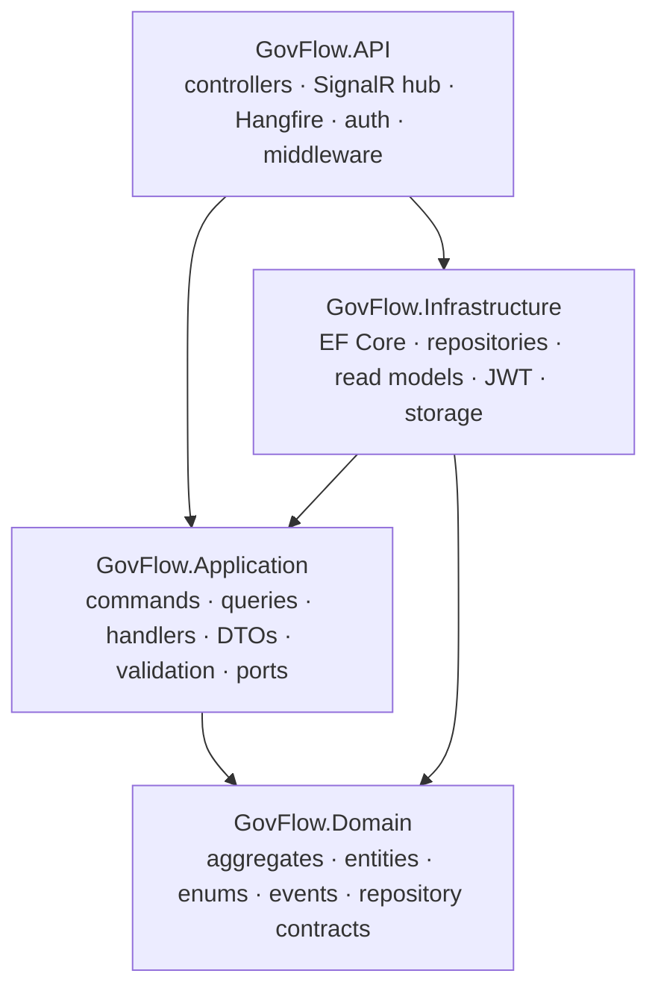
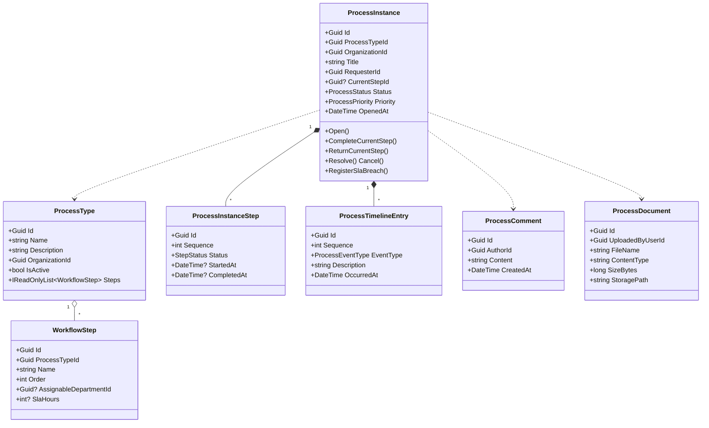
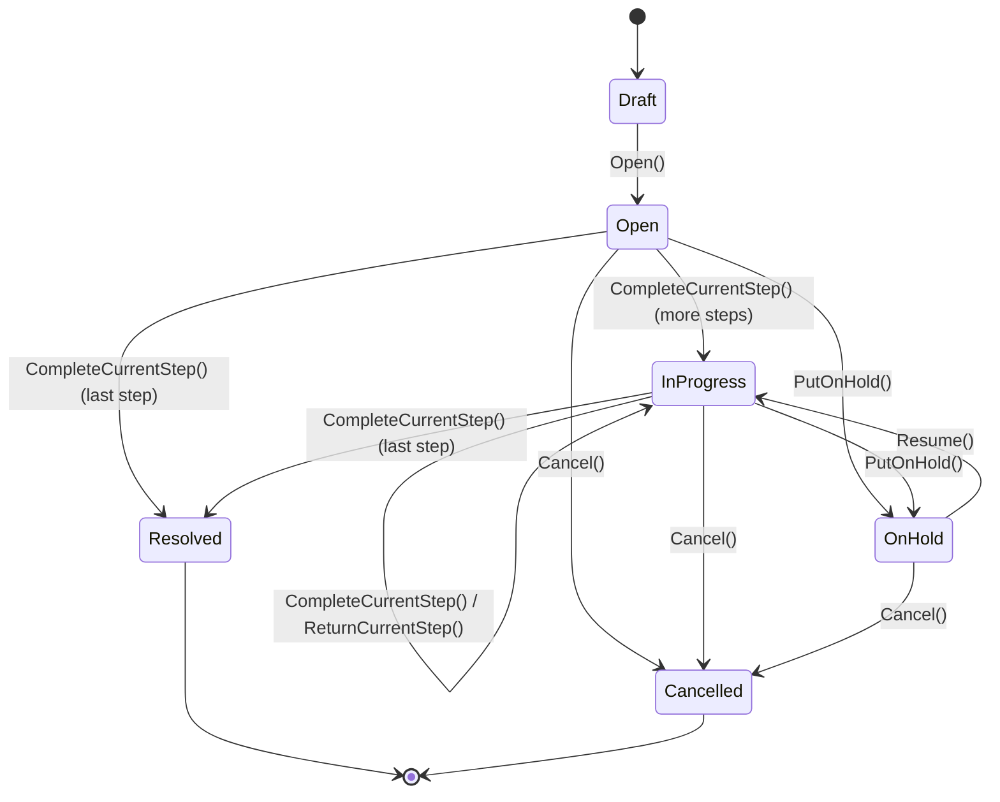
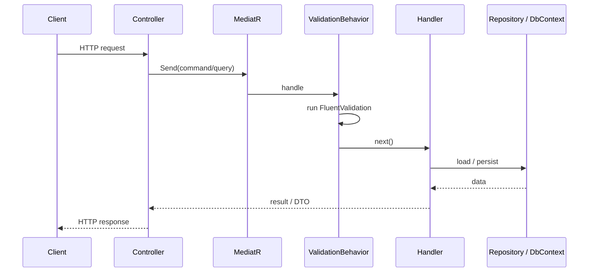
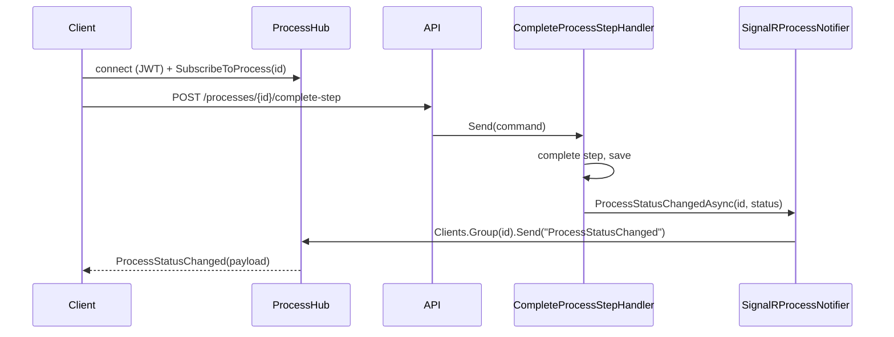
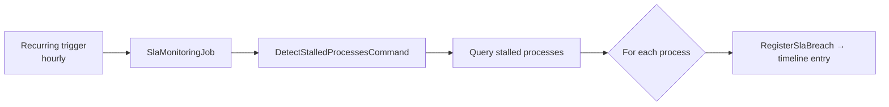

# GovFlow — Technical Architecture

GovFlow is a workflow and process management platform. Organizations define process types with
ordered workflow steps; users open process instances that move through those steps under a strict
state machine, with a full audit timeline, comments, document attachments, role-based access,
real-time updates and SLA monitoring.

This document describes the system **as it is implemented**.

---

## Technology stack

| Concern | Technology |
|---|---|
| Language / runtime | C# 12 · .NET 8 |
| Web framework | ASP.NET Core 8 |
| Persistence | Entity Framework Core 8 · Npgsql · PostgreSQL 16 |
| Application messaging | MediatR (commands, queries, handlers) |
| Validation | FluentValidation (MediatR pipeline behavior) |
| Authentication | JWT (HS256) access + refresh tokens · BCrypt password hashing |
| Authorization | Role-based policies |
| Real-time | SignalR |
| Background jobs | Hangfire (in-memory storage) |
| API documentation | Swashbuckle / Swagger UI |
| Tests | xUnit · `WebApplicationFactory` · EF Core InMemory provider |
| Local environment | Docker Compose (PostgreSQL + pgAdmin) |

---

## Clean Architecture

The solution is split into four projects with a strict inward-only dependency rule. The Domain has
no dependencies on frameworks, the database or the web layer.



`GovFlow.Infrastructure` and `GovFlow.API` implement the interfaces declared in the inner layers
(repositories from the Domain; `ICurrentUserService`, `IFileStorageService`,
`IProcessRealtimeNotifier`, `IJwtTokenGenerator`, `IPasswordHasher` and the read repositories from
the Application). Dependencies are wired at startup through `AddApplication` and `AddInfrastructure`.

### Project layout

```
src/
├── GovFlow.API
│   ├── Controllers              Auth, Organizations, ProcessTypes, Processes, Dashboard
│   ├── Hubs                     ProcessHub, SignalRProcessNotifier
│   ├── Jobs                     SlaMonitoringJob
│   ├── Authentication          JWT setup, policies, CurrentUserService
│   ├── Extensions              Swagger, Hangfire, WebApplication helpers
│   ├── Middleware              ExceptionHandlingMiddleware (RFC 7807)
│   └── Program.cs
├── GovFlow.Application
│   ├── Common                  Behaviors, Exceptions, Interfaces, Security
│   ├── Identity                Register / Login / Refresh
│   ├── Organization            Commands + Queries + DTOs
│   ├── Process                 Commands + Queries + DTOs
│   └── Dashboard               Query + DTO
├── GovFlow.Domain
│   ├── Common                  Entity, AuditableEntity, AggregateRoot, IDomainEvent, IUnitOfWork
│   ├── Identity                User, Role, RefreshToken (+ repository contracts)
│   ├── Organization            Organization, Department (+ repository contracts)
│   └── Process                 ProcessType, WorkflowStep, ProcessInstance, ProcessInstanceStep,
│                               ProcessTimelineEntry, ProcessComment, ProcessDocument, enums, events
└── GovFlow.Infrastructure
    ├── Persistence             GovFlowDbContext, Configurations, Repositories,
    │                           ReadRepositories, Migrations
    ├── Identity                JwtTokenGenerator, PasswordHasher
    └── Storage                 LocalFileStorageService
```

---

## Domain model (DDD)

The domain is organized into three areas: Identity, Organization and Process. Behavior lives in the
entities; `ProcessInstance` is the central aggregate root and the only entry point for mutating its
steps and timeline.



**Building blocks** (`GovFlow.Domain.Common`)

- `Entity` — identity by `Id` (Guid).
- `AuditableEntity` — adds `CreatedAt` / `UpdatedAt`.
- `AggregateRoot` — records domain events.
- `IDomainEvent` — marker for domain events, free of any framework dependency.
- `IUnitOfWork` — commit contract, implemented by the EF Core `DbContext`.

**Aggregates and ownership**

- `ProcessInstance` owns its `ProcessInstanceStep` and `ProcessTimelineEntry` collections. Every
  transition appends a timeline entry, so the history is a side-effect-free byproduct of the state
  machine.
- `ProcessComment` and `ProcessDocument` are small aggregates of their own, referenced by process id.

**Enums**

| Enum | Values |
|---|---|
| `ProcessStatus` | Draft, Open, InProgress, OnHold, Resolved, Cancelled, Rejected |
| `StepStatus` | Pending, InProgress, Completed, Skipped, Returned |
| `ProcessPriority` | Low, Normal, High, Critical |
| `ProcessEventType` | ProcessOpened, StepStarted, StepCompleted, StepReturned, ProcessResolved, ProcessCancelled, ProcessOnHold, ProcessResumed, SlaBreached |

### Process state machine



Opening an instance materializes one `ProcessInstanceStep` per `WorkflowStep` (ordered) and starts
the first one. Completing the last step resolves the process. Closed processes (`Resolved`,
`Cancelled`, `Rejected`) reject further transitions.

---

## CQRS with MediatR

Every operation is a MediatR `IRequest` handled by a single handler. Writes and reads are separated:

- **Commands** load aggregates through repositories, mutate them and commit through `IUnitOfWork`.
- **Queries** use read repositories that project directly to DTOs with EF Core and never return
  domain entities.

| Area | Commands | Queries |
|---|---|---|
| Identity | RegisterUser, LoginUser, RefreshToken | — |
| Organization | CreateOrganization, CreateDepartment | GetOrganizationById, GetOrganizations |
| Process | CreateProcessType, OpenProcessInstance, CompleteProcessStep, AddProcessComment, AttachProcessDocument, DetectStalledProcesses | GetProcessById, GetProcesses, GetProcessTypeById, GetProcessTypes, GetProcessTimeline, GetProcessComments, GetProcessDocuments |
| Dashboard | — | GetDashboard |

A single pipeline behavior runs for every request:

`ValidationBehavior<TRequest,TResponse>` executes all registered FluentValidation validators before
the handler. A failed validation throws `ValidationException`, which the API middleware maps to
`400 Bad Request` with field-level errors.

### Request pipeline



Domain and application exceptions are translated to RFC 7807 Problem Details by
`ExceptionHandlingMiddleware`: `NotFoundException` → 404, `ConflictException` → 409,
`UnauthorizedException` → 401, `ValidationException` → 400, `InvalidOperationException` → 422.

---

## Persistence (EF Core + PostgreSQL)

`GovFlowDbContext` is the EF Core unit of work over PostgreSQL and implements `IUnitOfWork`. Entity
mappings live one-per-file in `Persistence/Configurations` and are applied by convention. Schema is
versioned with EF Core migrations.

**Tables**

`organizations`, `departments`, `users`, `roles`, `refresh_tokens`, `process_types`,
`workflow_steps`, `process_instances`, `process_instance_steps`, `process_timeline_entries`,
`process_comments`, `process_documents`.

**Conventions**

- Guid primary keys generated in the domain; entity keys are configured `ValueGeneratedNever()`.
- Enums persisted as strings.
- Timestamps stored as `timestamp with time zone` (UTC).
- The `ProcessInstance` aggregate loads its `Steps` and `Timeline` together; read repositories query
  with `AsNoTracking()` and project to DTOs.

In Development, `GovFlowDbInitializer` applies migrations and seeds a demo organization, a process
type and an administrator account on startup (controlled by the `Database` configuration section).

---

## Authentication & authorization

**Authentication** — `POST /auth/register` and `POST /auth/login` issue a signed JWT access token
plus a refresh token; `POST /auth/refresh` exchanges a valid refresh token for a new pair. Tokens
are HS256-signed; passwords are hashed with BCrypt. Access tokens carry `sub`, `email`, `org` and
`role` claims.

**Authorization** — three role-based policies, each satisfied by the roles above it:

| Policy | Roles accepted | Applied to |
|---|---|---|
| `RequireAdmin` | Admin | create organizations |
| `RequireManager` | Manager, Admin | create departments, process types, open processes |
| `RequireAnalyst` | Analyst, Manager, Admin | complete steps, comment, upload documents |

The authenticated caller's identity is exposed to the Application layer through
`ICurrentUserService`, implemented over `IHttpContextAccessor`.

---

## Real-time updates (SignalR)

`ProcessHub` is an authenticated hub mapped at `/hubs/processes`. Clients subscribe to a specific
process; when its status changes the server pushes a `ProcessStatusChanged` message to that group.

The Application layer depends only on the `IProcessRealtimeNotifier` port; the API implements it with
`SignalRProcessNotifier` over `IHubContext<ProcessHub>`. The `OpenProcessInstance` and
`CompleteProcessStep` handlers notify after committing. For the WebSocket handshake the JWT is read
from the `access_token` query string.



---

## Background jobs (Hangfire)

Hangfire runs a recurring job (`sla-monitoring`, hourly by default) that sends
`DetectStalledProcessesCommand`. The handler finds open processes with no timeline activity within
the configured window (`Sla:IdleDays`, default 3) and records a `SlaBreached` entry on each one's
timeline. The operation is idempotent — a process is not flagged again until it shows new activity.

The detection logic lives entirely in the Application layer, so it is unit-tested without Hangfire;
the job is only the scheduler. The dashboard is served at `/hangfire` in Development. Storage is
in-memory; switching `UseInMemoryStorage()` to a persistent provider in `HangfireExtensions` is the
only change required to make jobs durable. The Hangfire server is disabled in the test host.



---

## Configuration

Settings live in `appsettings.json` and can be overridden by environment variables
(for example `ConnectionStrings__DefaultConnection`).

| Section | Keys |
|---|---|
| `ConnectionStrings` | `DefaultConnection` (PostgreSQL) |
| `JwtSettings` | `Issuer`, `Audience`, `SecretKey`, `AccessTokenExpiryMinutes`, `RefreshTokenExpiryDays` |
| `Database` | `ApplyMigrationsOnStartup`, `Seed` |
| `FileStorage` | `BasePath` (empty → `<app>/uploads`) |
| `Sla` | `IdleDays`, `Cron` |

Document uploads are stored on disk by `LocalFileStorageService`, behind the
`IFileStorageService` port so a cloud backend can replace it without touching the Application layer.

---

## Docker

`docker-compose.yml` provisions the local environment:

- **postgres** — PostgreSQL 16 on port 5432, with a health check and a named volume.
- **pgadmin** — database UI on port 5050.

```bash
docker compose up -d
dotnet run --project src/GovFlow.API
```

The API targets the PostgreSQL container via the default connection string and, in Development,
prepares the database automatically on first run.

---

## Tests

| Project | Scope |
|---|---|
| `GovFlow.Domain.Tests` | Aggregate behavior, the workflow state machine, timeline and SLA rules |
| `GovFlow.Application.Tests` | Command and query handlers in isolation, with in-memory fakes |
| `GovFlow.Integration.Tests` | Full HTTP pipeline over the EF Core InMemory provider: authentication, authorization, end-to-end flow, timeline, comments, PDF upload, real-time SignalR delivery and SLA detection |

Integration tests boot the real ASP.NET Core pipeline through `WebApplicationFactory<Program>` with
an isolated database per run, so the suite needs no external infrastructure.
